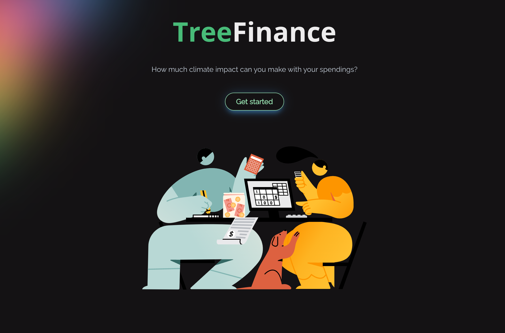
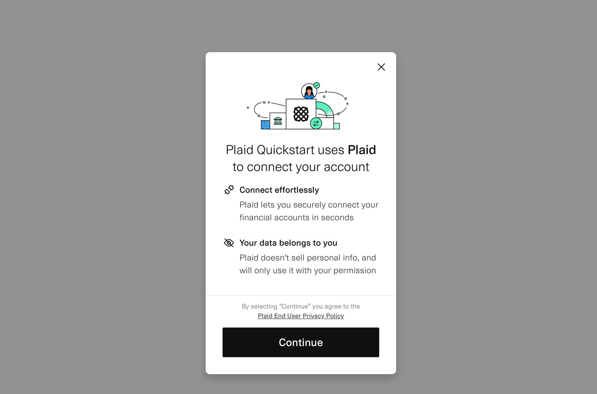
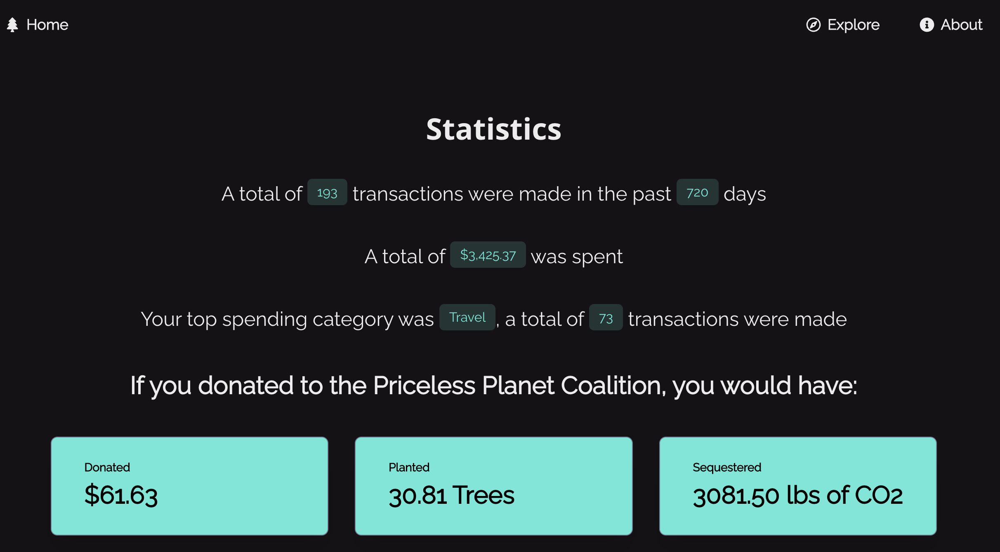
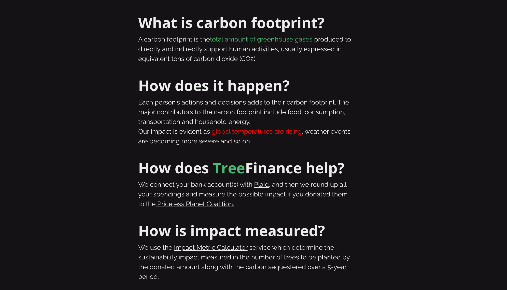
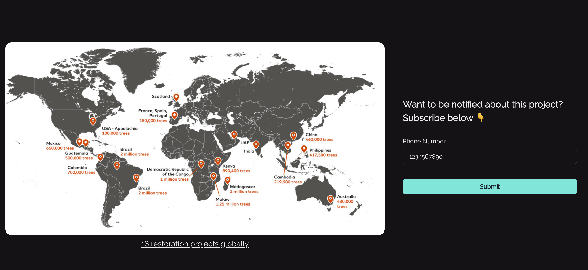

# TreeFinance

## Gallery







## Inspiration

Trees are an essential part of the planet's system for cleaning and renewing the air we breathe. It is an extremely cost-efficient solution for mitigating the impact of greenhouse gas emissions. However, many tree-planting projects around the world often go unnoticed and do not have an extensive reach to donors to fund their projects.

We use our cards every day to purchase items, be it restaurants, Netflix subscriptions, or gas and we almost always have change. Many a little makes a mickle. If we donate the change from every transaction to the tree-planting projects, thousands of trees can be planted. The challenge to overcome is awareness.

## What it does

TreeFinance aims to bridge the awareness gap by allowing users to track their historical transactions and analyze the number of trees they could have planted if they donate the change. This transaction tracker has the option to be real-time if the users wish to receive reminders about donating with every transaction. They will receive an SMS message delineating the transaction details, change amount, number of trees to be saved, and donation resources.

## How we built it

Front-end: ReactJS and ChakraUI

Back-end:

- Flask for the database
- Plaid API to connect cards and transaction history
- Mastercard Planet Data Services API to retrieve impact data
- Mastercard Transactions Notification API to get transactions in real-time
- Twilio API to send messages

## Challenges we ran into

We use many APIs for this project, so it was a challenge connecting to each and every one of them. Our team also has more experience with the back-end so some of us have to learn front-end to help out with the project.

## Accomplishments that we're proud of

We are proud that we have made a functional product. We also had a fun time connecting over the challenges and learning about some new tech stacks.

## What we learned

- Collaboration with other developers
- Implementing Twilio
- Utilizing Python/Flask with API for backend
- Efficient time management

## What's next for TreeFinance

We want to move TreeFinance out of sandbox mode and start integrating real cards into our system. This way we can get wider access to the Mastercard API and allow us to integrate more functionality such as the Carbon Calculator. We also want to incorporate more complicated data visualization and analysis into our project, such as spending patterns and project recommendations.

## How to run it

## install dependencies

```bash
cd app/backend
```

```bash
python -m venv venv
```

```bash
source venv/bin/activate
```

```bash
pip install -r requirements.txt
```

### setup openapi client

```bash
cd openapi_client
```

```bash
python setup.py install
```

### run the front end and backend

in app folder

to run the backend

Note: you need plaid_api_secrets.json file in the backend folder

````bash

```bash
npm run server
````

to run front end

```bash
npm run start
```

## plaid default credentials

- username: user_good
- password: pass_good

## TODO

- [ ] dockerize react and flask
